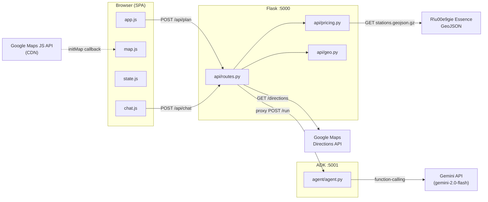
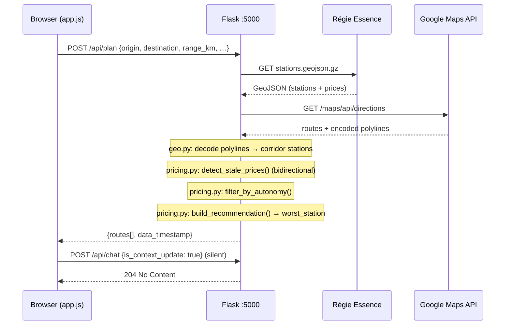
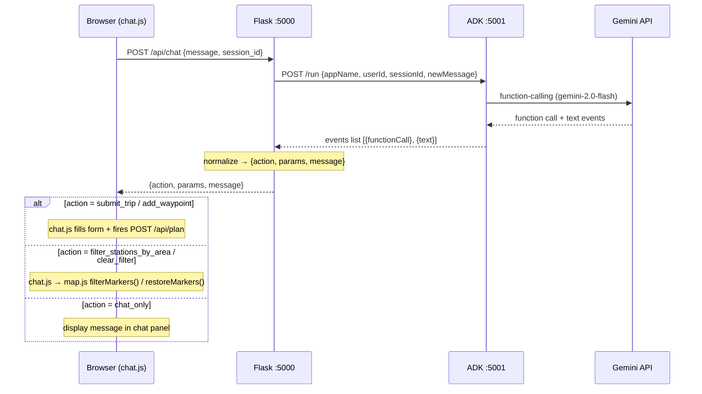

---
stepsCompleted:
  - step-01-init
  - step-02-context
  - step-03-starter
  - step-04-decisions
  - step-05-patterns
  - step-06-structure
  - step-07-validation
  - step-08-complete
  - update-anomaly-filter-2026-05-01
  - update-gemini-adk-integration-2026-05-31
  - update-review-findings-2026-06-15
lastStep: 8
status: 'complete'
completedAt: '2026-04-30'
lastUpdated: '2026-06-15'
updateHistory:
  - date: '2026-05-01'
    changes: 'Added anomaly detection (FR38-FR42): detect_stale_prices() in api/pricing.py, updated data flow, directory structure, requirements mapping, gap analysis (gaps 4-6: filter order, stations.yaml schema, ANOMALY_THRESHOLD_CAD constant), validation FR count 35→42'
  - date: '2026-05-09'
    changes: 'Extended Epic 4 (FR43–FR47): bidirectional anomaly detection (expensive direction), worst_station field in /api/plan route object, red AdvancedMarkerElement map marker for most expensive reachable station; FR count 42→47; updated data flow, requirements mapping, validation spot-checks, gap analysis gaps 4+6'
  - date: '2026-05-31'
    changes: 'Epic 5 Gemini/ADK integration (FR48–FR66): deployment model (separate ADK service port 5001), GEMINI_API_KEY handling, gemini-2.0-flash model selection, non-streaming /run endpoint, request/response shapes (frontend↔Flask↔ADK), agent definition & system instruction, route context injection protocol, agent/ directory, updated run.sh, requirements mapping, validation spot-checks; FR count 47→66'
  - date: '2026-06-15'
    changes: 'Absorbed architecture-review-2026-05-31 (Winston): added health scorecard, backend/frontend/cross-cutting findings with severity, tiered recommendations (§8), architectural decision on mapping vs ADK pattern (§3), critical issues list, anti-pattern note on three-place action duplication (§4)'
inputDocuments:
  - _bmad-output/planning-artifacts/prd.md
  - _bmad-output/planning-artifacts/product-brief-checkov.md
  - _bmad-output/planning-artifacts/ux-design-specification.md
  - _bmad-output/project-context.md
  - docs/architecture.md
  - docs/development-guide.md
  - docs/project-overview.md
  - docs/source-tree-analysis.md
workflowType: 'architecture'
project_name: 'checkov'
user_name: 'Olivier'
date: '2026-04-30'
---

# Architecture Decision Document

_checkov is a locally-hosted, single-user Flask + Vanilla JS web application that recommends fuel-efficient road trips across Quebec by combining Google Maps routing with live Régie Essence pricing data and a Gemini-powered conversational assistant. This document records all architectural decisions, module boundaries, naming conventions, data flows, and implementation constraints for the project. It covers 66 functional requirements across Epics 1–5, and incorporates health findings and tiered recommendations from the 2026-05-31 architecture review (§8). Last updated 2026-06-15._

## Table of Contents

1. [Project Context Analysis](#project-context-analysis)
2. [Stack & Technology Selection](#stack--technology-selection)
3. [Core Architectural Decisions](#core-architectural-decisions)
4. [Implementation Patterns & Consistency Rules](#implementation-patterns--consistency-rules)
5. [Project Structure & Boundaries](#project-structure--boundaries)
6. [Gemini API & ADK Integration](#gemini-api--adk-integration)
7. [Architecture Validation Results](#architecture-validation-results)
8. [Architecture Review Findings & Recommendations](#architecture-review-findings--recommendations)

## Project Context Analysis

### Requirements Overview

**Functional Requirements:** 66 FRs across eight domains:
- Trip Input (FR1–FR6): origin, destination, range, optional waypoints
- Route Discovery (FR7–FR10): Google Maps Directions API integration, polyline decoding
- Station Discovery (FR11–FR15): Régie Essence GeoJSON fetch, corridor matching (Haversine), fuel type filtering
- Price Quality Filtering (FR38–FR47): spatial stale-price anomaly detection **bidirectional** (cheap + expensive direction), density-adaptive neighbor radius, structural discounter exemption list (applied bidirectionally), kill switch, structured exclusion logging, `worst_station` in `/api/plan` response, red `AdvancedMarkerElement` map pin for most expensive reachable station
- Autonomy Filtering (FR16–FR18): distance-to-station calculation, safety buffer enforcement
- Recommendation Engine (FR19–FR23): cheapest/worst station per route, per-litre and per-tank savings, route ranking
- Map & Display (FR24–FR30, FR46–FR47): interactive Google Maps JS rendering, bi-directional card/map sync, data freshness indicator, distinct red marker for most expensive reachable station per route
- Conversational Assistant (FR48–FR66): Gemini-powered chat panel, natural-language trip initiation, waypoint addition, geographic station filtering, Google ADK agent as separate service, `/api/chat` Flask proxy

**Non-Functional Requirements:**
- **Performance:** Full pipeline (API + compute + render) completes within a few seconds
- **Accuracy:** Savings calculations within ¢0.1/L of live Régie Essence data
- **Safety:** Autonomy filter never recommends a station beyond remaining range minus safety buffer
- **Resilience:** Graceful degradation on Régie Essence endpoint failure (error display, no crash)
- **Platform:** macOS laptop, Chrome/Safari latest — no multi-browser matrix, no mobile requirement

**Scale & Complexity:**
- Primary domain: Full-stack web application (locally-hosted SPA)
- Complexity level: Low-medium — single user, no auth, no DB, no compliance; geospatial algorithm layer is the primary engineering challenge
- Estimated architectural components: ~6 (backend API server, routing client, GeoJSON client, geospatial engine, recommendation engine, frontend SPA)

### Technical Constraints & Dependencies

- **Brownfield:** `checkov.py` (270 LOC) must be extracted from a runnable script into an importable Python module; `parse_price_value`, `fetch_stations`, and GeoJSON dual-parse logic are reused verbatim
- **API key isolation:** Google Maps Directions API key must remain server-side — never exposed in frontend JavaScript or network responses
- **GeoJSON dual-parse:** Régie Essence endpoint may return pre-decompressed JSON or raw gzip — dual-parse strategy must be preserved from existing code
- **Google Maps JS API ToS:** Map rendering uses the JavaScript API (compliant); Directions calls are backend-only
- **Python 3.9+ required:** Existing codebase uses built-in generics (`dict[str, Any]`); no `typing` container imports
- **No database:** User settings persist via `localStorage` only; backend is stateless

### Cross-Cutting Concerns Identified

- **Polyline decoding** — Google Maps Directions API returns encoded polylines; decoding to lat/lng points is a prerequisite for all corridor matching. Net-new logic not present in existing codebase.
- **Haversine corridor matching** — for each route, find all GeoJSON stations within N km of any decoded polyline point. Core algorithm; must be efficient enough to run against the full Quebec station dataset (~3,000+ stations).
- **Configurability propagation** — corridor distance and safety buffer are user-configurable; these values must flow consistently from frontend settings → backend request → filtering logic.
- **Map ↔ card sync** — selecting a route card must highlight that route on the map, and vice versa; this is the primary frontend state management challenge.
- **Data freshness transparency** — the GeoJSON `generated_at` timestamp must be surfaced in the UI so the user can assess price staleness.

## Stack & Technology Selection

### Primary Technology Domain

Full-stack web application (brownfield) — Python backend + browser-based SPA, locally hosted on macOS.
No traditional starter template applies; this section records the foundational stack decisions.

### Stack Selection: Flask 3.1.3 + Vanilla JS

**Rationale:** Flask 3.1.3 (Python ≥3.9) preserves the existing Python version constraint.
Its functional decorator model aligns with the project's no-class convention.
No JavaScript build tooling is needed for a single-user local tool — vanilla JS with
ES modules keeps the tech stack entirely in Python + plain HTML/JS.

**Backend initialization:**

```bash
pip install flask==3.1.3
```

**Architectural Decisions Established:**

**Language & Runtime:** Python 3.9+, WSGI synchronous (Flask + Werkzeug dev server)

**Project Structure:**
```
app.py                # Flask application entry point
api/
  routes.py           # @app.route endpoint handlers
  geo.py              # Polyline decoding + Haversine corridor matching (net-new)
  pricing.py          # Extracted from checkov.py: fetch_stations, parse_price_value
static/
  index.html          # SPA shell
  js/
    app.js            # Main SPA logic (ES modules)
    map.js            # Google Maps JS API integration
    state.js          # Route selection state + card/map bidirectional sync
  css/
    style.css
```

**Frontend:** Vanilla JS ES modules, no bundler, no framework. Google Maps JS API via CDN.
Settings (fuel type, tank size, corridor, buffer) persisted via `localStorage`.

**Static Serving:** Flask serves `/static` natively; root route (`/`) serves `index.html`.

**Development:** `flask --app app run --debug` (hot reload enabled)

**Note:** Project restructuring (extracting `checkov.py` into `api/pricing.py` and
creating `app.py`) should be the first implementation story.

## Core Architectural Decisions

### Decision Priority Analysis

**Critical Decisions (Block Implementation):**
- API shape: single `/api/plan` endpoint
- API key isolation: environment variable, never in frontend
- Hard fail on external service errors

**Important Decisions (Shape Architecture):**
- Frontend state: singleton module pattern
- Project launch: `run.sh` script

**Deferred Decisions (Post-MVP):**
- Progressive rendering / two-step API (Phase 2 if latency becomes an issue)
- Graceful degradation for Régie Essence outages (Phase 2)

### Data Architecture

- **No database.** Backend is fully stateless. All persistent state lives in the browser (`localStorage`).
- **Data flow per request:** `run.sh` → Flask → `/api/plan` → [Google Maps Directions API + Régie Essence GeoJSON] → geospatial engine → recommendation engine → JSON response → frontend render.
- **Settings schema** (stored in `localStorage`): `{ fuel_type, tank_litres, corridor_km, safety_buffer_km }`. Defaults match PRD: corridor 2 km, buffer = max(10% of range, 15 km).

### Authentication & Security

- **No authentication.** Single-user local tool on `localhost`. No login, no sessions, no CSRF surface.
- **API key isolation — Google Maps:** `GOOGLE_MAPS_API_KEY` loaded from environment variable at Flask startup. Loaded via `python-dotenv` from a `.env` file listed in `.gitignore`. Key is **never** included in any JSON response or frontend-accessible route.
- **API key isolation — Gemini:** `GEMINI_API_KEY` follows the identical pattern. Consumed exclusively by the ADK agent process — Flask never reads, forwards, or logs it. See §Gemini API & ADK Integration for the full key-handling specification.
- **No CORS configuration needed** — frontend, Flask backend, and ADK agent all share `localhost`.

### API & Communication Patterns

- **Trip planning endpoint:** `POST /api/plan`
  - Request body: `{ origin, destination, range_km, waypoints[], fuel_type, corridor_km, buffer_km }`
  - Response: `{ routes: [{ label, drive_time, polyline, stations: [...], best_station, worst_station, savings_per_litre, savings_per_tank_cad }], data_timestamp, error? }`
- **Chat proxy endpoint:** `POST /api/chat`
  - Request body: `{ message, session_id, is_context_update? }`
  - Response: `{ action, params, message }` — see §Gemini API & ADK Integration for full schema.
  - Proxies to ADK agent service on `localhost:5001`; returns HTTP 502 on ADK/Gemini failure. Form-based workflow remains unaffected.
- **Hard fail policy:** If Google Maps Directions API fails OR Régie Essence GeoJSON fetch fails, `/api/plan` returns HTTP 502 with a structured error body `{ error: "source", message: "..." }`. Rationale: without live pricing, route cost comparison has no value. Chat endpoint follows the same pattern: ADK unreachable → 502 with `{ error: "adk_agent", ... }`.
- **Static file serving:** Flask root route (`GET /`) serves `static/index.html`. All other static assets served from `/static/`.
- **Error response schema:** `{ error: "google_maps" | "regie_essence" | "adk_agent" | "internal", message: string }`

### Frontend Architecture

- **State management:** `state.js` exports a singleton object with:
  - `state.routes[]` — loaded results
  - `state.selectedRouteIndex` — currently highlighted route
  - `state.setSelectedRoute(index)` — updates selection and fires a DOM `CustomEvent("routeSelected")` that both `map.js` and card components listen to
  - `state.settings` — mirrored from `localStorage`
- **Module structure:** ES modules (`type="module"`), no bundler. `app.js` is the entry point; it imports `map.js`, `state.js`, and handles form submission + card rendering.
- **Google Maps JS API:** Loaded via CDN `<script>` tag with `loading=async` and `callback=initMap`. Map instance stored in `map.js` module scope.
- **Bidirectional sync:** Card clicks call `state.setSelectedRoute(index)`; map marker clicks call the same function. The `routeSelected` CustomEvent triggers visual updates in both surfaces.

### Decision: Mapping Architecture — Not an Agent, But a Tool Source

**Decided:** 2026-05-31 (absorbed from architecture review).

**The question answered:** Should geospatial/mapping adopt the same ADK agent pattern used by chat?

The "ADK pattern" bundles two independent decisions that must be evaluated separately:

- **Pattern A — LLM-as-reasoner:** Use a language model to interpret ambiguous input and select a structured action.
- **Pattern B — Capability-as-microservice:** Run the capability in its own process, communicate over HTTP with a typed contract.

**Pattern A for mapping: No.**
Mapping is deterministic input → deterministic output. Given an origin, destination, and corridor, polyline decode and corridor station filtering have exactly one correct answer. Inserting an LLM in that path would add 500–2000 ms latency, introduce non-determinism into reproducible savings calculations, cost money on every plan request, and make the functions untestable.

**Pattern B (microservice split) for mapping: Not yet.**
`api/pricing.py` and `api/geo.py` are pure-Python, fast, and stateless. The ADK process split is justified for chat because ADK has its own runtime, long-lived session state, and a distinct failure profile. None of those apply to pricing or geo today. Premature service decomposition is distributed coupling. The split becomes appropriate when: (a) `pricing` grows a Redis cache with a refresh job, (b) the anomaly detector becomes an ML model with heavyweight dependencies, or (c) multiple consumers need pricing outside `/api/plan`.

**The right frame:** Mapping should not *be* an agent, but it should *expose tools* the agent can call. Candidates for future agent tools: `explain_anomaly()` (why a station was hidden), `compare_routes()` (trade-off explanation), `get_current_trip()` (state pull for the agent instead of push-fed context updates).

**Agent action contract duplication (known smell):** The tools the ADK agent can call (`submit_trip`, `add_waypoint`, `filter_stations_by_area`, `clear_filter`) are currently defined in three places: Python stubs in `agent/agent.py` (for ADK schema introspection), the `ALLOWED_ACTIONS` whitelist in `api/routes.py`, and the dispatch switch in `static/js/chat.js`. Drift is inevitable. The target state is a single Python dataclass/Pydantic model per action that generates the ADK stub, the routes validator, and a JSON schema the frontend imports. See §8 Tier 1 Recommendation #1.

### Infrastructure & Deployment

- **Launch:** `run.sh` — loads `.env`, starts the ADK agent service (`adk api_server agent --port 5001`) in the background with a `trap EXIT` kill, then starts Flask (`flask --app app run --debug`). Single command launches both processes. The ADK process PID is stored for clean teardown on Ctrl-C.
- **No CI/CD.** Personal local tool.
- **Logging:** Follows project context rule — `logging.Logger` with `StreamHandler(sys.stdout)`, `%(message)s` format. Flask access logs suppressed or minimal.
- **`.gitignore` additions:** `.env`, `__pycache__/`, `*.pyc`

### Decision Impact Analysis

**Implementation Sequence (ordered by dependency):**
1. Extract `api/pricing.py` from `checkov.py` (prerequisite for everything)
2. Create `app.py` + `run.sh` + Flask skeleton
3. Implement `api/geo.py` (polyline decoding + Haversine)
4. Implement `POST /api/plan` route wiring all components together
5. Build `static/index.html` + form + card layout
6. Implement `state.js` singleton + `map.js` Google Maps integration
7. Wire card ↔ map bidirectional sync
8. Implement settings drawer + `localStorage` persistence

**Cross-Component Dependencies:**
- `api/geo.py` is a hard dependency of `routes.py` — cannot implement the endpoint without polyline decoding
- `api/pricing.py` must preserve `parse_price_value` and `fetch_stations` signatures exactly — downstream recommendation logic depends on them
- `state.js` must be initialized before `map.js` and card rendering — it is the single source of truth for selection state

## Implementation Patterns & Consistency Rules

### Critical Conflict Points (9 identified)

API response shape, JSON field naming convention, Flask route registration location,
localStorage key management, loading/error UI ownership, Google Maps init callback,
DOM custom event naming, HTTP status code usage, settings defaults location.

### Naming Patterns

**API JSON fields:** `snake_case` throughout. No camelCase translation layer.
Example: `drive_time_seconds`, `savings_per_litre`, `distance_from_origin_km`

**Flask route functions:** `snake_case`, verb-prefixed.
Example: `plan_trip()`, `serve_index()`

**JavaScript functions:** `camelCase`.
Example: `setSelectedRoute()`, `renderCards()`, `initMap()`

**JavaScript files:** `snake_case`.
Example: `state.js`, `map.js`, `app.js`

**`localStorage` keys:** `SCREAMING_SNAKE_CASE` constants, defined only in `state.js`.
```js
const SETTINGS_KEY = "checkov_settings";  // defined once, referenced everywhere
```
Never use raw string literals for localStorage keys outside `state.js`.

**DOM Custom Events:** `camelCase`.
Example: `routeSelected`, `resultsLoaded`, `planError`

### API Format Patterns

**Success response** — direct JSON, no wrapper:
```json
{
  "routes": [...],
  "data_timestamp": "2026-04-30T18:00:00Z"
}
```

**Error response:**
```json
{ "error": "regie_essence", "message": "Failed to fetch GeoJSON: connection timeout" }
```
HTTP status codes: `400` bad input, `502` upstream failure (Google Maps or Régie Essence), `500` unexpected internal error.

**Route object schema:**
```json
{
  "label": "Via Hwy 50",
  "drive_time_seconds": 8040,
  "drive_time_display": "2 h 14 min",
  "polyline_encoded": "...",
  "stations": [...],
  "best_station": { ... },
  "worst_station": { ... },
  "savings_per_litre": 0.082,
  "savings_per_tank_cad": 3.28
}
```

**Station object schema:**
```json
{
  "name": "Ultramar Lachute",
  "address": "123 rue Principale, Lachute",
  "price_per_litre": 1.429,
  "distance_from_route_km": 0.4,
  "distance_from_origin_km": 87.2,
  "lat": 45.851,
  "lng": -74.334,
  "is_best": true
}
```

### Structure Patterns

**Flask route registration:** All routes in `api/routes.py` via a Flask Blueprint.
`app.py` creates the app and registers the blueprint only — zero routes in `app.py`.

```python
# app.py — correct
from api.routes import bp
app.register_blueprint(bp)

# app.py — WRONG, never do this
@app.route("/api/plan")
def plan_trip(): ...
```

**Module responsibilities (strict):**
- `api/pricing.py` — GeoJSON fetch, price parsing, autonomy filtering. Ported from `checkov.py`.
- `api/geo.py` — polyline decoding, Haversine distance. All geospatial math lives here.
- `api/routes.py` — HTTP layer only. Calls functions from `pricing.py` and `geo.py`. No business logic inline.

**Settings defaults:** Defined once in `state.js` as `DEFAULT_SETTINGS`. Never hardcoded elsewhere.
```js
const DEFAULT_SETTINGS = {
  fuel_type: "Régulier",
  tank_litres: 50,
  corridor_km: 2.0,
  safety_buffer_km: 15
};
```

### Process Patterns

**Loading state:** Owned exclusively by `app.js`.
```js
// app.js — correct
document.body.classList.add("is-loading");
// ... fetch ...
document.body.classList.remove("is-loading");
```
No other module adds/removes `is-loading`.

**Error display:** Owned exclusively by `app.js` via `#error-banner`.
```js
// app.js — correct
const banner = document.getElementById("error-banner");
banner.textContent = message;
banner.hidden = false;
```
No other module touches `#error-banner`.

**Google Maps init callback:** Always `window.initMap`, always defined in `map.js`.
```js
// map.js
export function initMap() { ... }
window.initMap = initMap;
```
Never defined inline in `index.html` script tags.

### Enforcement Guidelines

**All AI agents MUST:**
- Use `snake_case` for all Python identifiers and all JSON API fields
- Use `camelCase` for all JavaScript functions and variables
- Register Flask routes only in `api/routes.py` via Blueprint
- Never inline business logic in route handlers — delegate to `pricing.py` or `geo.py`
- Never duplicate `DEFAULT_SETTINGS` or `SETTINGS_KEY` — import from `state.js`
- Never use string literals for localStorage keys outside `state.js`
- Never define `initMap` outside `map.js`

**Anti-patterns to avoid:**
- ❌ `@app.route(...)` in `app.py`
- ❌ Haversine calculation inline in a route handler
- ❌ `localStorage.setItem("settings", ...)` with a raw string key outside `state.js`
- ❌ `{ "data": { "routes": [...] } }` response wrapper
- ❌ `camelCase` JSON fields in API responses (e.g., `driveTime` instead of `drive_time_seconds`)
- ❌ Adding a new agent tool to `agent/agent.py` without updating `ALLOWED_ACTIONS` in `api/routes.py` and the dispatch switch in `chat.js` — all three places must stay in sync until the single-contract refactor (§8 Tier 1 #1) is complete

## Project Structure & Boundaries

### System Architecture Overview



### Complete Project Directory Structure

```
checkov/
├── .env                          # GOOGLE_MAPS_API_KEY, GEMINI_API_KEY (gitignored)
├── .env.example                  # Template with key names, empty values
├── .gitignore                    # .env, __pycache__/, *.pyc
├── README.md
├── requirements.txt              # flask==3.1.3, python-dotenv, requests, pyyaml, colorama, google-adk>=1.0
├── run.sh                        # Launch script: loads .env, starts ADK agent (port 5001) + Flask (port 5000)
├── stations.yaml                 # Preserved (existing CLI)
├── checkov.py                  # Preserved (existing CLI)
├── app.py                        # Flask app factory: creates app, registers Blueprint
├── agent/                        # Google ADK agent package
│   ├── __init__.py              # exports root_agent for `adk api_server`
│   └── agent.py                 # Agent: system instruction, tool definitions (submit_trip,
│                             #   add_waypoint, filter_stations_by_area, clear_filter)
├── api/
│   ├── __init__.py
│   ├── routes.py                 # Blueprint; POST /api/plan, POST /api/chat
│   ├── pricing.py                # fetch_stations, parse_price_value, detect_stale_prices,
│   │                             # filter_by_autonomy, build_recommendation — ported from
│   │                             # checkov.py + anomaly detection (net-new)
│   └── geo.py                    # decode_polyline, haversine, find_stations_in_corridor,
│                                 # distance_along_route
├── static/
│   ├── index.html                # SPA shell: form, #route-cards, #error-banner, map container,
│   │                             # #chat-panel (collapsible bottom of left column)
│   ├── css/
│   │   └── style.css             # Layout, card styles, loading overlay, map container, chat panel,
│   │                             # chat bubbles, typing indicator, filter badge, form field flash
│   └── js/
│       ├── app.js            # Entry point: form submit, fetch /api/plan, renderCards(),
│       │                         # loading state (is-loading), error display (#error-banner),
│       │                         # context update on trip load (POST /api/chat is_context_update)
│       ├── map.js            # Google Maps JS API: initMap(), renderRoutes(), renderMarkers(),
│       │                         # filterMarkers(area), restoreMarkers(), filter badge,
│       │                         # window.initMap = initMap
│       ├── state.js          # Singleton: DEFAULT_SETTINGS, SETTINGS_KEY, state object,
│       │                         # setSelectedRoute(), loadSettings(), saveSettings(),
│       │                         # sessionId (UUID, in-memory only)
│       └── chat.js           # Chat panel: collapse/expand, input handling, POST /api/chat,
│                                 # action dispatch, form field flash, action confirmation toasts
└── tests/
    ├── __init__.py
    ├── test_pricing.py           # Unit tests: parse_price_value(), filter_by_autonomy(),
    │                             # build_recommendation() — mock requests.get
    ├── test_geo.py               # Unit tests: haversine(), decode_polyline(),
    │                             # find_stations_in_corridor() — pure function tests
    └── test_routes.py            # Integration tests: POST /api/plan — mock pricing + geo
```

### Architectural Boundaries

**Module responsibilities (enforced):**
- `api/routes.py` — HTTP layer only; calls `pricing.py` and `geo.py`; proxies `/api/chat` to ADK
- `api/pricing.py` — GeoJSON fetch, price parsing, anomaly filter, autonomy filter, recommendation builder
- `api/geo.py` — polyline decode, Haversine, corridor matching
- `agent/agent.py` — ADK agent definition: system instruction, tool registrations (`submit_trip`, `add_waypoint`, `filter_stations_by_area`, `clear_filter`); no Flask or pricing logic
- `app.js` — owns loading state (`is-loading`), error display (`#error-banner`), and trip context updates (fires silent `POST /api/chat` with `is_context_update: true` after each `/api/plan` success)
- `chat.js` — owns chat panel: input events, collapse/expand toggle, `POST /api/chat`, action dispatch to `state.js` / `map.js`, form field flash animation, action confirmation toasts
- `state.js` — owns all `localStorage` access, route selection state, and `sessionId` (in-memory UUID)
- `map.js` — owns Google Maps instance, all map rendering, `filterMarkers()`, `restoreMarkers()`, filter badge creation/removal

**Data flow — trip planning:**



**Data flow — chat (conversational assistant):**



### Requirements to Structure Mapping

| FR Domain | File(s) |
|---|---|
| FR1–FR6 Trip Input | `static/index.html`, `static/js/app.js` |
| FR7–FR10 Route Discovery + Polyline | `api/routes.py`, `api/geo.py` |
| FR11–FR15 Station Discovery | `api/pricing.py`, `api/geo.py` |
| FR38–FR44 Price Quality Filtering | `api/pricing.py` (`detect_stale_prices()` — bidirectional cheap + expensive) |
| FR45 `worst_station` in `/api/plan` response | `api/pricing.py` (`build_recommendation()`), `api/routes.py` |
| FR46–FR47 Most Expensive Station Marker | `static/js/map.js` (`renderMarkers()`) |
| FR16–FR18 Autonomy Filtering | `api/pricing.py` |
| FR19–FR23 Recommendation Engine | `api/pricing.py` |
| FR24–FR27 Map Visualization | `static/js/map.js` |
| FR28–FR30 Recommendation Display | `static/js/app.js` |
| FR48–FR50 Chat UI | `static/index.html`, `static/js/chat.js` |
| FR51–FR53 NL Trip Initiation | `agent/agent.py` (submit_trip tool), `static/js/chat.js` |
| FR54–FR56 NL Waypoint Addition | `agent/agent.py` (add_waypoint tool), `static/js/chat.js` |
| FR57–FR60 NL Map Filtering | `agent/agent.py` (filter_stations_by_area, clear_filter tools), `static/js/chat.js`, `static/js/map.js` |
| FR61–FR66 ADK Agent Integration | `agent/agent.py`, `api/routes.py` (`/api/chat`), `static/js/chat.js` |
| Settings persistence | `static/js/state.js` |

### Integration Points

**External integrations:**
- Google Maps Directions API — called from `api/routes.py`, key from `GOOGLE_MAPS_API_KEY` env var
- Google Maps JavaScript API — loaded via CDN `<script>` in `index.html`, callback `window.initMap`
- Régie Essence GeoJSON endpoint — called from `api/pricing.py`, User-Agent header required
- Gemini API — called by the ADK agent process via `google-adk`/`google-genai`; key from `GEMINI_API_KEY` env var; model `gemini-2.0-flash`; non-streaming (`/run` endpoint); never called directly by Flask
- Google ADK agent service — Flask proxies `POST /api/chat` to `http://localhost:5001/run` via `requests`

**Internal communication:**
- Backend modules communicate via direct Python function calls
- Frontend modules communicate via `state.setSelectedRoute()` + `CustomEvent("routeSelected")`
- `app.js` → `state.js` and `map.js` via ES module imports + custom events

## Gemini API & ADK Integration

_Added 2026-05-31. Covers Epic 5 (Conversational Assistant): FR48–FR66._

### Deployment Model: Separate ADK Service

The Google ADK agent runs as a **separate process** on `localhost:5001`, distinct from Flask on port 5000.

**Rationale:**
- ADK manages its own session state and conversation memory. Embedding it inside Flask's WSGI process introduces shared-state complexity with no benefit.
- ADK ships `adk api_server` — a production-ready FastAPI HTTP server. There is no reason to fight its process model.
- If the ADK process crashes or becomes slow, Flask continues serving the form-based workflow uninterrupted (natural graceful degradation for NFR12).

**Trade-off accepted:** Two processes to launch instead of one. Mitigated by updating `run.sh` to start both in parallel with a clean `trap EXIT` teardown.

**`run.sh` (updated):**
```bash
#!/bin/bash
set -e

[ -f .env ] && export $(grep -v '^#' .env | xargs)

# Start ADK agent in background; kill it when this script exits
adk api_server agent --port 5001 &
ADK_PID=$!
trap "kill $ADK_PID 2>/dev/null" EXIT

# Start Flask (blocks until Ctrl-C)
flask --app app run --debug
```

> **Note:** The `.env` loading pattern (`grep -v '^#' .env | xargs`) fails silently on values containing spaces, special characters, or embedded `=` signs. A more robust alternative is `set -a; source .env; set +a`. For this single-user local tool the simpler pattern is acceptable, but be aware of the constraint.

### API Key Handling

`GEMINI_API_KEY` follows the **identical isolation pattern** as `GOOGLE_MAPS_API_KEY`:

- Stored in `.env` (gitignored), loaded at ADK process start via `python-dotenv` / `os.environ`
- Consumed exclusively by the `agent/` process — Flask never reads, forwards, or logs it
- Never appears in any HTTP response, log line, or client-side source

`.env.example` additions:
```
GOOGLE_MAPS_API_KEY=
GEMINI_API_KEY=
```

The ADK agent picks up `GEMINI_API_KEY` automatically when instantiated with `google-genai` as its backend; no explicit key-passing in application code.

### Model Selection

**Decision: `gemini-2.0-flash`**

| Candidate | Verdict | Reasoning |
|---|---|---|
| `gemini-2.0-flash` | ✅ Selected | Fast (~1–2 s), strong function-calling, cheapest at this capability tier. The 4-tool intent classifier is simple structured extraction — Flash is well-matched. |
| `gemini-1.5-pro` | ❌ Rejected | Higher latency and cost with no capability advantage for this narrow task. |
| `gemini-2.5-pro` | ❌ Rejected | Reasoning-optimized; slower and overkill for structured extraction over 4 tools. |

NFR12 requires ≤5 s total round-trip. `gemini-2.0-flash` contributes ~1–2 s, leaving comfortable budget for ADK session overhead and the Flask proxy hop.

### Streaming vs. Non-Streaming

**Decision: non-streaming (`POST /run`, not `POST /run_sse`)**

The frontend cannot dispatch any UI action (`submit_trip`, `add_waypoint`, etc.) until it has the **complete** `action` + `params` object. Partial SSE events carry no incremental value for action dispatch — the action type and all extracted parameters must arrive atomically.

Streaming would only benefit scenarios where prose is rendered word-by-word. Here, chat responses are brief confirmations (1–2 sentences) that appear after the action fires. A spinner in the chat panel covers the perceived wait without requiring a streaming connection.

### Request / Response Shapes

#### 1. Frontend → Flask `POST /api/chat`

```json
{
  "message": "Montréal to Duhamel, 180 km range",
  "session_id": "a1b2c3d4-e5f6-...",
  "is_context_update": false
}
```

`session_id` is a UUID generated in `state.js` (`crypto.randomUUID()`) when the chat panel is first opened. It lives **in memory only** — not in `localStorage`. A page reload starts a fresh session; context loss is acceptable for a single-user local tool.

`is_context_update: true` is set by `app.js` after a successful `/api/plan` call to inject the current trip parameters into the ADK session silently (no response needed by the frontend).

#### 2. Flask → ADK `POST http://localhost:5001/run`

Flask proxies using `requests.post` (10 s hard timeout — hard abort prevents hung requests against the 5 s NFR12 budget):

```json
{
  "app_name": "checkov_assistant",
  "user_id": "local_user",
  "session_id": "a1b2c3d4-e5f6-...",
  "new_message": {
    "role": "user",
    "parts": [{ "text": "Montréal to Duhamel, 180 km range" }]
  }
}
```

#### 3. ADK → Flask (raw events list)

ADK `/run` returns a synchronous list of agent turn events:

```json
[
  {
    "content": {
      "role": "model",
      "parts": [{ "functionCall": { "name": "submit_trip",
                                    "args": { "origin": "Montréal",
                                              "destination": "Duhamel",
                                              "range_km": 180,
                                              "waypoints": [] } } }]
    }
  },
  {
    "content": {
      "role": "model",
      "parts": [{ "text": "Planning Montréal → Duhamel with 180 km range — loading routes." }]
    }
  }
]
```

Flask normalizes: extracts the first `functionCall` part (if present) and the last `text` part.

#### 4. Flask → Frontend (normalized response)

```json
{
  "action": "submit_trip",
  "params": { "origin": "Montréal", "destination": "Duhamel", "range_km": 180, "waypoints": [] },
  "message": "Planning Montréal → Duhamel with 180 km range — loading routes."
}
```

**`action` dispatch table:**

| `action` | `params` shape | Frontend behaviour |
|---|---|---|
| `submit_trip` | `{ origin, destination, range_km, waypoints[] }` | `chat.js` auto-fills form + submits `POST /api/plan` |
| `add_waypoint` | `{ waypoint: string }` | `chat.js` appends waypoint + re-submits `POST /api/plan` |
| `filter_stations_by_area` | `{ area_name, lat, lng }` | `chat.js` → `map.js filterMarkers(area)` |
| `clear_filter` | `{}` | `chat.js` → `map.js restoreMarkers()` |
| `chat_only` | `{}` | Display `message` in chat panel only (clarification / error) |

**`/api/chat` error response** (ADK unreachable or 10 s timeout exceeded):
```json
{ "error": "adk_agent", "message": "Assistant unavailable — use the form to plan your trip." }
```
HTTP 502. Form-based workflow is unaffected.

### Agent Definition

The ADK agent package lives at `agent/`:

```python
# agent/agent.py
from google.adk.agents import Agent
from google.adk.tools import FunctionTool
from typing import Optional

SYSTEM_INSTRUCTION = """
You are the Checkov trip assistant. You help users plan fuel-efficient road trips in Quebec.

You have four tools:
- submit_trip: call when the user describes a new trip (origin, destination, optional range and waypoints)
- add_waypoint: call when the user wants to add an intermediate stop to the current trip
- filter_stations_by_area: call when the user wants to see only station prices near a specific location
- clear_filter: call when the user wants to restore all station markers on the map

Rules:
1. Always call a tool when the user's intent clearly matches one of these actions.
2. If a required field is missing (origin or destination for submit_trip), ask one clarifying
   question — never call submit_trip with placeholder values.
3. Respond in the same language the user writes in (French or English).
4. After calling a tool, confirm the action in 1–2 sentences maximum.
5. Do not invent station names, prices, or route details — you have no access to live data.
"""

def submit_trip(origin: str, destination: str,
                range_km: Optional[float] = None,
                waypoints: Optional[list[str]] = None) -> dict:
    """Extract trip parameters from natural language."""
    return {"ok": True}

def add_waypoint(waypoint: str) -> dict:
    """Extract a waypoint location name to append to the current trip."""
    return {"ok": True}

def filter_stations_by_area(area_name: str, lat: float, lng: float) -> dict:
    """Extract a geographic area for station marker filtering."""
    return {"ok": True}

def clear_filter() -> dict:
    """Signal the frontend to restore all station markers."""
    return {"ok": True}

root_agent = Agent(
    name="checkov_assistant",
    model="gemini-2.0-flash",
    instruction=SYSTEM_INSTRUCTION,
    tools=[submit_trip, add_waypoint, filter_stations_by_area, clear_filter],
)
```

Tools return `{"ok": True}` — actual action dispatch is the Flask proxy's responsibility, not the tool's.

### Route Context Injection

ADK sessions maintain conversation history natively (satisfies FR66). The current trip state is injected via a **synthetic context message** — not by mutating the system instruction at runtime (which ADK does not support per-session).

**Protocol:**

1. After `app.js` receives a successful `/api/plan` response, it fires a silent `POST /api/chat` with `is_context_update: true`:
   ```json
   {
     "message": "[TRIP CONTEXT] origin=\"Montréal, QC\", destination=\"Duhamel, QC\", range_km=180, waypoints=[]",
     "session_id": "a1b2c3d4-...",
     "is_context_update": true
   }
   ```
2. `api/routes.py` detects `is_context_update: true`, proxies to ADK, and **returns HTTP 204** — no body, no frontend UI update. The context message is silent from the user's perspective.
3. ADK appends the context turn to the session history. Subsequent user messages ("add a stop through Grenville") resolve correctly against it.

**What is NOT injected:** Full route results (station prices, polylines, drive times) are never sent to the agent. The agent only needs origin/destination/range/waypoints for intent resolution — not the full result set. This keeps prompt tokens low and avoids sending detailed routing data outside the local machine.

**Session lifecycle:** A new `session_id` is generated on page load. If the user starts a second trip, `app.js` fires another context update on the same session — the history accumulates, which is intentional (it gives the agent the "current trip" context). If session history grows problematically long in a single tab session, ADK's context window limits apply naturally.

### New Dependencies

```
# requirements.txt additions
google-adk>=1.0
```

`google-adk` brings `google-genai` as a transitive dependency. No separate Gemini SDK package is needed.

### New Anti-Patterns

**All AI agents implementing Epic 5 MUST:**
- Define the ADK `root_agent` only in `agent/agent.py` — never inline agent initialization elsewhere
- Never read `GEMINI_API_KEY` in Flask — it is the ADK process's exclusive concern
- Never call `generativelanguage.googleapis.com` directly from Flask — route through the ADK service
- Never stream from `/api/chat` (`run_sse`) — use non-streaming `/run` exclusively
- Never expose `session_id` management in `app.js` — it belongs to `state.js`
- Never send full station/price/route data in the context update message — trip parameters only

**Anti-patterns to avoid:**
- ❌ `import google.generativeai` in `api/routes.py`
- ❌ `GEMINI_API_KEY` read inside `app.py` or `api/routes.py`
- ❌ Streaming (`/run_sse`) for the chat proxy
- ❌ `window.sessionId = ...` inline in `index.html`
- ❌ Injecting full `/api/plan` response body into the ADK context message

## Architecture Validation Results

### Coherence Validation ✅

**Decision Compatibility:**
- Flask 3.1.3 requires Python ≥3.9 — matches project constraint exactly
- `python-dotenv` integrates cleanly with Flask's app factory pattern
- Vanilla JS ES modules natively supported in Chrome/Safari latest — no polyfills needed
- Google Maps JS API CDN + `type="module"` scripts coexist without conflict
- No version conflicts across the full stack

**Pattern Consistency:**
- `snake_case` API fields align with Python backend; no translation layer introduced
- Blueprint pattern in `api/routes.py` is consistent with Flask conventions and the no-class rule
- `CustomEvent` pattern is native DOM — no library dependency introduced
- `localStorage` singleton in `state.js` is consistent with the stateless backend decision

**Structure Alignment:**
- Every module boundary has a documented responsibility
- `app.py` as pure factory (no routes) enforced by anti-pattern rule
- `tests/` structure matches project context rules: pytest, `tests/` dir, `test_<module>.py` naming

### Requirements Coverage Validation ✅

**Functional Requirements (66 FRs) — all covered.**

_Epics 1–4 spot-checks (FR1–FR47):_

| FR | Coverage |
|---|---|
| FR38 — detect stale stations below local median | `api/pricing.py` `detect_stale_prices()` |
| FR39 — density-adaptive radius (expand until ≥5 neighbors) | `api/pricing.py` `detect_stale_prices()` |
| FR40 — structural discounter exemption list | `stations.yaml` `anomaly_filter_exemptions`; checked in `detect_stale_prices()` |
| FR41 — kill switch (disable without code deploy) | `stations.yaml` `anomaly_filter_enabled`; checked in `api/routes.py` before calling filter |
| FR42 — structured log entry per excluded station | `checkov.pricing` logger in `detect_stale_prices()` |
| FR43 — detect stale stations above local median (expensive direction) | `api/pricing.py` `detect_stale_prices()` — same `ANOMALY_THRESHOLD_CAD`, same exemption list, same log format |
| FR44 — bidirectional anomaly detection | `api/pricing.py` `detect_stale_prices()` — both directions in one call; `float('inf')` sentinel applied to cheap and expensive outliers |
| FR45 — `worst_station` field in `/api/plan` response | `api/pricing.py` `build_recommendation()` returns most expensive non-anomalous reachable station; `api/routes.py` includes it in the route object |
| FR46 — red map marker for most expensive station | `static/js/map.js` `renderMarkers()` — red `AdvancedMarkerElement` (`--error: #DC2626`); always derived from post-filter station list |
| FR47 — hover + enlarge behaviour for worst marker | `static/js/map.js` `renderMarkers()` — hover tooltip with name + price; enlarges on `routeSelected` event matching cheapest marker behaviour |
| FR10 — decode route polylines | `api/geo.py` `decode_polyline()` |
| FR12 — Haversine corridor matching | `api/geo.py` `find_stations_in_corridor()` |
| FR16 — distance from origin to station | `api/geo.py` `distance_along_route()` |
| FR17 — autonomy filter with safety buffer | `api/pricing.py` `filter_by_autonomy()` |
| FR18 — no reachable stations case | empty `stations[]` response; `app.js` renders "no stations" message |
| FR27 — station marker interaction | `map.js` `renderMarkers()` click handler → `state.setSelectedRoute()` |
| FR30 — data freshness timestamp | `data_timestamp` field in API response; rendered in `app.js` |

**Non-Functional Requirements:**

| NFR | Requirement | Architectural Mechanism |
|---|---|---|
| Performance | Full pipeline completes within a few seconds | Single `/api/plan` endpoint; GeoJSON fetched once per request, filtered in-memory; no DB round-trips |
| Accuracy | Savings calculations within ¢0.1/L of live data | `parse_price_value()` reused verbatim from battle-tested `checkov.py` |
| Safety | Autonomy filter never recommends out-of-range stations | `filter_by_autonomy()` gates all recommendations — no out-of-range station reaches `build_recommendation()` |
| Resilience | Graceful degradation on Régie Essence failure | HTTP 502 + structured error body; `#error-banner` in frontend displays it |
| NFR12 | Chat response ≤5 s end-to-end | `gemini-2.0-flash` ~1–2 s; 10 s hard abort in Flask proxy; spinner covers perceived wait |
| NFR13 | Single launch command | `run.sh` starts both Flask and ADK agent with one `bash run.sh` command |
| NFR14 | Gemini key isolation | `GEMINI_API_KEY` consumed by ADK process only; Flask never reads or forwards it — see §Gemini API & ADK Integration |
| Security | `GOOGLE_MAPS_API_KEY` never exposed to client | Key injected server-side via Jinja2 template; never included in JSON responses, frontend JS, or log output |

_Epic 5 spot-checks (FR48–FR66):_

| FR | Coverage |
|---|---|
| FR48 — persistent chat panel | `static/index.html` `#chat-panel`; `static/js/chat.js` |
| FR51 — NL trip extraction | `agent/agent.py` `submit_trip` tool; Gemini function-calling |
| FR52 — auto-fill + submit on extraction | `chat.js` receives `action: "submit_trip"`, fills form, fires `POST /api/plan` |
| FR53 — clarify on missing required field | System instruction rule 2: ask one clarifying question before calling `submit_trip` with missing origin/destination |
| FR54–FR56 — waypoint addition via chat | `agent/agent.py` `add_waypoint` tool; `chat.js` appends + re-submits; works from form or chat origin |
| FR57–FR60 — geographic map filter + clear | `agent/agent.py` `filter_stations_by_area` / `clear_filter` tools; `chat.js` → `map.js filterMarkers()` / `restoreMarkers()`; route cards unchanged |
| FR61 — ADK as separate service | `agent/` package; `adk api_server agent --port 5001` in `run.sh` |
| FR62 — `/api/chat` Flask proxy | `api/routes.py` `chat_proxy()` → `requests.post("http://localhost:5001/run", ...)` |
| FR63 — Gemini for NLU | `agent/agent.py` `root_agent` with `model="gemini-2.0-flash"` |
| FR64 — 4 structured tools | `submit_trip`, `add_waypoint`, `filter_stations_by_area`, `clear_filter` defined in `agent/agent.py` |
| FR65 — `{action, params, message}` response | Flask normalizes ADK events list in `chat_proxy()` before returning |
| FR66 — session context for follow-ups | ADK session maintains history; trip context injected via synthetic `[TRIP CONTEXT]` message after each `/api/plan` success |

### Implementation Readiness Validation ✅

- **Decision Completeness:** All critical decisions documented with versions, rationale, and anti-patterns
- **Structure Completeness:** Every file named, every module's public API described
- **Pattern Completeness:** 9 conflict points identified and resolved; enforcement guidelines documented

### Gap Analysis

**Critical Gaps: None.**

**Important Gaps (must be addressed in implementation stories):**

1. **`decode_polyline()` algorithm** — Use the `polyline` PyPI package (`pip install polyline`) rather than implementing the Google Encoded Polyline Algorithm from scratch. Add `polyline` to `requirements.txt`.

2. **`distance_along_route()` semantics** — Distance from origin to station is the cumulative distance along the route polyline to the nearest polyline point, not straight-line distance. Implementation story must specify this clearly.

3. **Google Maps JS API key in `index.html`** — The Maps JavaScript API key must be injected into `index.html` at serve time by Flask (via template rendering), not hardcoded in the static file. The same `GOOGLE_MAPS_API_KEY` env var serves both the Directions API (backend `requests` calls) and the Maps JS API (injected via Jinja2 template) — no second key is required. Flask’s root route renders `index.html` as a Jinja2 template with `render_template("index.html", google_maps_api_key=...)`.

4. **Anomaly filter placement in `api/pricing.py`** — `detect_stale_prices(stations, all_stations, threshold, exemptions)` must be called in `routes.py` **after** corridor matching and **before** `filter_by_autonomy()`. This order is mandatory: the anomaly filter requires the full `all_stations` dataset (for neighbor lookup), so it must run while that dataset is still in scope. The filter is **bidirectional**: stations priced more than `ANOMALY_THRESHOLD_CAD` below *or* above the local median are both set to `float('inf')` — cheap-direction exclusions prevent inflated savings; expensive-direction exclusions prevent `worst_station` from being set by a stale high-price outlier.

5. **`stations.yaml` config schema additions** — Two new top-level keys are required:
   - `anomaly_filter_enabled: true` (boolean kill switch; default `true`)
   - `anomaly_filter_exemptions: ["costco", "olco"]` (list of case-insensitive name substrings)
   These must be loaded and passed through from `fetch_stations()` into the route handler, then forwarded to `detect_stale_prices()`. No UI exposure required.

6. **`ANOMALY_THRESHOLD_CAD` constant** — Defined once in `api/pricing.py` as `ANOMALY_THRESHOLD_CAD = 0.05` (i.e., 5¢/L). Applied **bidirectionally** (both cheap and expensive direction) using the same threshold value. Never hardcoded elsewhere. Configurable only by editing this constant — not a user-facing setting.

**Nice-to-Have:**
- `run.sh` should check if `.env` exists and warn if `GOOGLE_MAPS_API_KEY` is unset
- Phase 2: Graceful Régie Essence degradation (show routes without pricing)
- Phase 2: `distance_along_route()` upgraded to driving distance via Maps Roads API

### Architecture Completeness Checklist

**Requirements Analysis** — see §Project Context Analysis
- [x] Project context thoroughly analyzed
- [x] Scale and complexity assessed
- [x] Technical constraints identified
- [x] Cross-cutting concerns mapped

**Architectural Decisions** — see §Core Architectural Decisions
- [x] Critical decisions documented with versions — §Data Architecture, §Authentication & Security, §API & Communication Patterns
- [x] Technology stack fully specified — §Stack & Technology Selection
- [x] Integration patterns defined — §Integration Points
- [x] Performance considerations addressed — §Requirements Coverage Validation (NFR table)

**Implementation Patterns** — see §Implementation Patterns & Consistency Rules
- [x] Naming conventions established — §Naming Patterns
- [x] Structure patterns defined — §Structure Patterns
- [x] Communication patterns specified — §API Format Patterns
- [x] Process patterns documented — §Process Patterns

**Project Structure** — see §Project Structure & Boundaries
- [x] Complete directory structure defined — §Complete Project Directory Structure
- [x] Component boundaries established — §Architectural Boundaries
- [x] Integration points mapped — §Integration Points
- [x] Requirements to structure mapping complete — §Requirements to Structure Mapping

**Architecture Review** — see §8 Architecture Review Findings & Recommendations
- [x] Health scorecard produced — §8 Health Scorecard
- [x] Backend, frontend, and cross-cutting findings documented with severity — §8.1–8.3
- [x] Critical issues ordered by leverage — §8.4
- [x] Tiered recommendations (Tier 1/2/3) documented — §8.5
- [x] Architectural decision on mapping vs ADK pattern recorded — §3 Decision: Mapping Architecture

### Architecture Readiness Assessment

**Overall Status: READY FOR IMPLEMENTATION**
**Confidence Level: High**

**Key Strengths:**
- Brownfield extraction risk mitigated: `pricing.py` is a direct port, not a rewrite
- The hardest algorithm (`geo.py`) is fully isolated and independently testable
- Zero ambiguity in module ownership — every piece of state and every UI concern has exactly one owner
- Gap around `decode_polyline()` flagged with a concrete solution (`polyline` package)

**Areas for Future Enhancement:**
- Phase 2: Graceful Régie Essence degradation
- Phase 2: Driving-distance routing to stations (vs. crow-flies)

### Implementation Handoff

**AI Agent Guidelines:**
- Read `_bmad-output/project-context.md` before writing any code
- Follow all architectural decisions exactly as documented in this file
- Use implementation patterns from the Consistency Rules section for every file created
- Respect module boundaries — never inline business logic in route handlers
- Address the 3 Important Gaps in the first implementation stories

**First Implementation Priority:**
1. Add `polyline` to `requirements.txt`
2. Confirm `GOOGLE_MAPS_API_KEY` in `.env.example` covers both Directions API and Maps JS injection (same key, no second var needed)
3. Extract `api/pricing.py` from `checkov.py`
4. Create `app.py` Flask factory + `run.sh`

## Architecture Review Findings & Recommendations

_Review conducted by Winston (System Architect) on 2026-05-31. Absorbed into this document 2026-06-15. Scope: full-stack review — Flask backend, vanilla JS SPA, ADK chat agent, orphaned CLI._

### Health Scorecard

| Dimension | Grade | Notes |
|---|---|---|
| Backend modularity | A− | Clean layers; minor leaky mutations (see §8.1) |
| Frontend modularity | C+ | `app.js` god-module risk, `map.js` globals |
| Coupling | B | Chat ↔ map is the worst offender |
| Consistency | B− | Two patterns for missing prices, two patterns for chat↔map comms, error-handling style varies |
| Operational readiness | C | No caching, no request IDs, hardcoded service URL |
| Security posture | B+ | XSS guards, secret masking; no schema validation |
| Testability | B | Backend pure functions excellent; frontend has no seams |
| Conceptual integrity (agent ↔ app) | C | Tool definitions duplicated in 3 places; silent context update is a smell |

### 8.1 Backend Findings

| Finding | Severity | Location |
|---|---|---|
| `geo.find_stations_in_corridor` mutates input stations in place (adds `distance_from_route_km`). Callers must know. | Low | `api/geo.py` |
| `pricing.rank_routes` mutates inputs in place — inconsistent with the rest of `pricing.py`, which returns new objects. | Low | `api/pricing.py` |
| `_CONFIG_PATH` is a module-level constant in `routes.py` pointing at the YAML. Mixes HTTP orchestration with disk layout knowledge. | Low | `api/routes.py` |
| `float('inf')` sentinel for missing prices is clever but spreads magic-value semantics. Frontend mirrors with `isFinite()`. Two patterns, one concept. | Low | `api/pricing.py`, `static/js/app.js` |
| No request/response schema validation (no Pydantic, no JSON schema). Contracts live in code only. | Medium | API boundary |
| YAML is re-read from disk on every `/api/plan` call. No mtime check, no cache. | Low | `api/routes.py` |

### 8.2 Frontend Findings

| Finding | Severity | Location |
|---|---|---|
| `app.js` (~620 LOC) handles form, card rendering, settings drawer, error banner, reachability banner, timestamp, skeleton, and low-range indicator. God module forming. | Medium | `static/js/app.js` |
| `map.js` keeps `map`, `polylines`, `markers`, `infoWindow` as module-level mutable globals. Re-init or a second map instance would break. | Medium | `static/js/map.js` |
| `chat.js` imports `filterMarkers`/`restoreMarkers` directly from `map.js`. Other interactions go through `CustomEvent`s. Two conventions for the same problem. | Medium | `static/js/chat.js`, `static/js/map.js` |
| Backend error `message` is intentionally dropped on the frontend (`_message` argument). Safe by default, but loses diagnostic value in dev. | Low | `static/js/app.js` |
| No type system, no JSDoc on contract objects (`route`, `station`, `action` payload). Contracts drift silently. | Medium | All `static/js/*.js` |

### 8.3 Cross-Cutting Findings

| Finding | Severity |
|---|---|
| **No caching layer.** Every `/api/plan` = 1 Régie Essence fetch (all of Quebec) + 1 Google Maps call + 1 disk YAML read. Régie data changes minutes-to-hours, not seconds. | **High** |
| **Duplicated GeoJSON fetch & price parsing** between `checkov.py` and `api/pricing.py`. | Medium |
| **`ADK_SERVICE_URL` hardcoded** to `http://localhost:5001` in `routes.py`. Will break the first real deployment. | Medium |
| Logging is inconsistent — Python uses `logging`, JS has none. No request IDs to correlate frontend errors with backend logs. | Low |
| No HTTP cache headers on `/api/plan` (POST anyway, but worth deciding). Static assets served via Flask, no CDN posture. | Low |

### 8.4 Critical Issues (ordered by leverage)

1. **Cold cache on every request.** Two upstream calls per `/api/plan`. Single-user dev hides this. First production traffic spike won't.
2. **`checkov.py` is orphaned legacy code that duplicates `pricing.py`.** Delete it, or extract a `regie_essence_client.py` and have both use it. Any fix to GeoJSON handling must currently be made twice.
3. **`ADK_SERVICE_URL` hardcoded.** Move to env var, default to localhost.
4. **`app.js` god-module risk.** Split before it hits 1000 LOC and becomes untouchable.
5. **`map.js` module globals.** Wrap in a `MapController` factory so state is owned and disposable.
6. **No schema validation on API boundary.** A typo in `submit_trip` params from the LLM could silently misfill the form.

### 8.5 Recommendations

#### Tier 1 — Do these soon

1. **Single source of truth for agent actions.** Define each action as a Python dataclass/Pydantic model. Generate the ADK tool stub, the `routes.py` validator, and a JSON schema the frontend imports. Eliminates the three-place duplication flagged in §3 (mapping/ADK decision).
2. **Cache Régie Essence at module level with TTL.** Even a 5-minute in-process cache eliminates the duplicate-fetch storm when a user adjusts settings and re-plans. ~20 lines.
3. **Cache YAML config with mtime check.** Re-read only if the file changed. Trivial.
4. **Delete or merge `checkov.py`.** Extract `regie_essence_client.py` if keeping the CLI; otherwise delete. The duplication is a footgun.
5. **`MapController` factory wrapping `map.js` globals.** `function createMapController() { ... return { renderRoutes, renderMarkers, filterMarkers, ... } }`. Disposable, testable, multi-map-ready.
6. **Env-var-driven `ADK_SERVICE_URL`.** `os.environ.get("ADK_SERVICE_URL", "http://localhost:5001")`. One-line ops unblock.

#### Tier 2 — Plan for these

7. **Split `app.js`** into `form.js`, `cards.js`, `settings.js`; leave `app.js` as a thin bootstrap.
8. **JSDoc the contract objects** (`Route`, `Station`, `AgentAction`). Free intellisense, free drift detection.
9. **Pydantic models on `/api/plan` and `/api/chat`.** Contracts are already documented in comments — make them executable.
10. **Replace the silent context update with a tool call.** Server keeps trip state per `session_id`; agent calls `get_current_trip()` when needed. Aligns with ADK SDK design and keeps the conversation log honest.
11. **Server-Sent Events on `/api/chat`.** ADK responses can stream. SSE makes the assistant feel alive for free.
12. **Request IDs end-to-end.** UUID generated client-side, sent in `X-Request-Id`, logged on backend. Without this, debugging a user-reported failure requires guessing timestamps.

#### Tier 3 — Bigger bets, only when the problem appears

13. **Shareable trip URLs.** Push form state + selected route into the URL via History API. Free deep linking, large UX dividend, tiny code change.
14. **Progressive `/api/plan` response.** Stream route shapes first, then stations as scored. Today the user sees a spinner for the slowest call (Régie Essence).
15. **Replace in-process anomaly heuristic with a time-series view.** Today "stale" is inferred from spatial median deviation. With persisted price history, staleness becomes a direct measurement. This is where a real ML model — and a Pattern B microservice split — would finally earn its keep.
16. **Edge-cached Régie data.** A Cloudflare Worker pulling the GeoJSON every 5 minutes and serving from KV would remove Régie Essence from the critical path entirely.
17. **TypeScript on the frontend.** Not urgent. But the cost grows linearly with JS LOC, and the project is at ~1290.
18. **Agent observability.** Log every tool call, params, and outcome. Today the agent is a black box — when a user says "it filled the wrong destination," there is no trace.

---

_"Don't make mapping an agent — make the agent's tools and the frontend's actions the same contract, cache the upstreams, and break up `app.js` before it breaks you."_ — Winston
