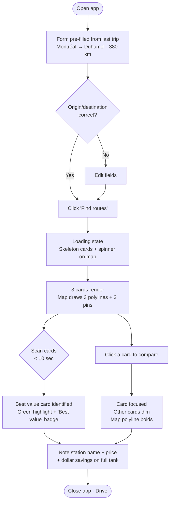
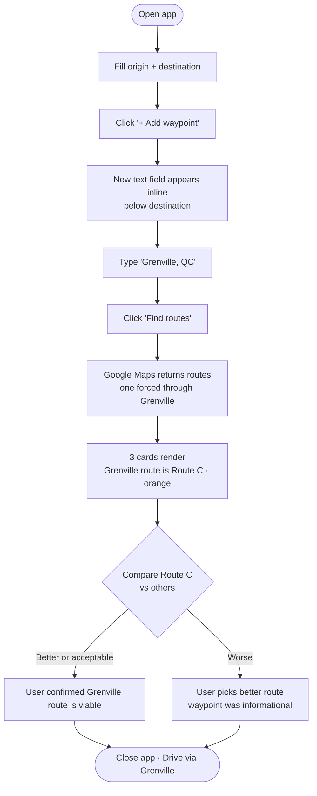
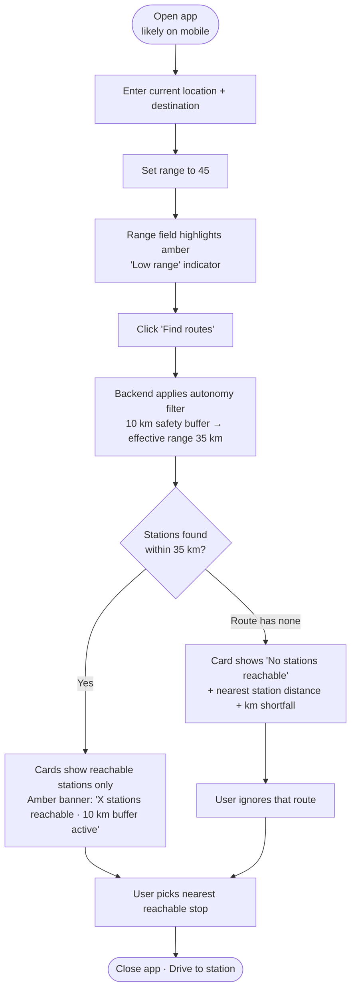
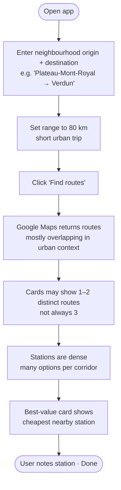

---
stepsCompleted:
  - step-01-init
  - step-02-discovery
  - step-03-core-experience
  - step-04-emotional-response
  - step-05-inspiration
  - step-06-design-system
  - step-07-defining-experience
  - step-08-visual-foundation
  - step-09-design-directions
  - step-10-user-journeys
  - step-11-component-strategy
  - step-12-ux-patterns
  - step-13-responsive-accessibility
  - step-14-complete
inputDocuments:
  - _bmad-output/planning-artifacts/prd.md
  - _bmad-output/planning-artifacts/product-brief-gaz_eye.md
  - _bmad-output/project-context.md
  - docs/project-overview.md
  - docs/architecture.md
---

# UX Design Specification — gaz_eye

**Author:** Olivier
**Date:** 2026-04-30

---

<!-- UX design content will be appended sequentially through collaborative workflow steps -->

## Executive Summary

### Project Vision

Gaz Eye is a locally-hosted web application that replaces a fragmented three-tool workflow (Google Maps + Régie Essence website + mental arithmetic) with a single screen. The user enters a trip and immediately sees three alternative routes, each with its cheapest reachable Quebec gas station, savings vs. the worst option on that route, and drive time. One screen, one decision.

### Target Users

**Primary (and only) user:** Olivier — a technically proficient driver running the app on a macOS laptop (Chrome or Safari). Use context ranges from relaxed pre-trip planning to urgent roadside decisions with low fuel. Single-user tool, no onboarding, no auth, no help system needed.

### Key Design Challenges

1. **Information density vs. scan speed.** Three routes × stations × prices × savings must be readable in seconds. The user is often in a hurry.
2. **Map + panel co-design.** The interactive map and the recommendation panel must stay in sync — selecting a route in either should update the other. This is the core interaction design challenge.
3. **Low-fuel urgency mode.** When the user has very limited range (e.g., 45 km), most stations are filtered out. The UI must communicate scarcity and the best option clearly, without overwhelming.

### Design Opportunities

1. **Three-card comparison layout** as the primary pattern — each route as a self-contained card with drive time, best station, price, and savings. Pick the card, that's the decision.
2. **Settings as an accessible drawer** — configurable parameters (fuel type, tank size, corridor, safety buffer) available without leaving the main view.
3. **Single dataset-level freshness indicator** — the Régie Essence GeoJSON provides one `generated_at` timestamp for the entire pull. Display it unobtrusively so the user knows how recent the pricing data is.

## Core User Experience

### Defining Experience

The core action is: **enter a trip, read three cards, pick one, go**. Everything else is setup or edge case. The product lives or dies on how fast a user can go from blank form to confident decision — the target is under 10 seconds of reading time once results load.

### Platform Strategy

- **Web app, desktop-first** — runs on `localhost` on a macOS laptop, accessed in Chrome or Safari
- **Mouse + keyboard** primary; touch/mobile is secondary (Journey 3 shows a legitimate mobile-from-parked-car use case, but it's not the design target)
- **No offline functionality** — requires live network for Google Maps API and Régie Essence GeoJSON
- **No progressive web app features needed** — single user, no install or notification requirements

### Effortless Interactions

- **Form submission** — one click after filling origin/destination/range; no pagination or steps
- **Route selection** — clicking a card or a route on the map selects it; the other highlights accordingly; no separate "apply" button
- **Waypoint add/remove** — inline in the form, not a modal; add a text field, remove with an × button
- **Settings persistence** — fuel type, tank size, corridor, and buffer are remembered between sessions (localStorage); the user should never have to re-enter them

### Critical Success Moments

1. **Results load, three cards appear** — this is the "aha" moment. Prices are visible, savings are visible, the map shows routes. The user immediately knows what to do.
2. **Low-range query returns exactly 1-3 options** — the system correctly filtered everything unreachable; the user trusts the recommendation because the logic is transparent (distance shown, buffer noted).
3. **Waypoint route is the best option** — the user added Grenville, and Gaz Eye confirms their intuition by showing that route has cheaper gas. Validates the feature in a single use.

### Experience Principles

1. **Decision speed above all** — every design choice should reduce time-to-decision. If it adds a step, it needs a strong justification.
2. **Map and cards are one view, not two** — they must stay in sync at all times. Selecting either updates the other instantly.
3. **Transparency builds trust** — show the data timestamp, show the corridor distance, show why a station was excluded (out of range). Don't hide the logic.
4. **Settings are rarely changed, but must be easy to reach** — persistent defaults, accessible in one click, never blocking the main flow.

## Desired Emotional Response

### Primary Emotional Goals

**Primary feeling: Confident and in control.** The user makes a fuel decision backed by real data, not a guess. That feeling of "I know I'm getting a good deal" is the core emotional payoff.

**Secondary feeling: Efficient and unencumbered.** The app gets out of the way quickly. No friction, no learning curve, no wasted time.

### Emotional Journey Mapping

| Stage | Desired Feeling | Avoid |
|-------|----------------|-------|
| Opening the app | Familiar, ready | Overwhelming |
| Filling in the form | Effortless, quick | Tedious |
| Waiting for results | Expectant (brief wait) | Anxious |
| Reading the three cards | Clear, decisive | Confused, overloaded |
| Low-fuel urgency state | Focused, reassured | Panicked |
| After picking a route | Satisfied, resolved | Second-guessing |

### Micro-Emotions

- **Confidence** — the data source is government-mandated and fresh; the user trusts the prices shown
- **Efficiency** — results arrive fast; the decision is made in seconds
- **Mild delight** — when the waypoint route turns out to be the cheapest option (confirms the user's instinct)
- **Reassurance** — in low-fuel mode, seeing "here's what you can actually reach" is calming, not alarming

**Emotions to avoid:**
- Confusion from information overload
- Anxiety when no stations are reachable (must feel like useful information, not a failure)
- Skepticism about data freshness (mitigated by visible timestamp)

### Design Implications

- **Confidence → Clear hierarchy.** The recommended card is visually distinct (e.g., highlighted border, "Best value" label). The user doesn't have to hunt for the answer.
- **Efficiency → Minimal chrome.** No splash screens, no onboarding modals, no confirmation dialogs. Form → Submit → Results.
- **Reassurance in urgency → Honest messaging.** When range is very low, show "2 stations reachable" not "8 stations filtered." Focus on what's available, not what's gone.
- **Trust → Transparency.** Show the data timestamp, show the corridor radius, show the distance to each station. The logic is visible.

### Emotional Design Principles

1. **Calm utility over excitement** — this isn't a flashy product. The right emotional target is a well-designed dashboard: reliable, readable, immediately useful.
2. **Never leave the user guessing** — every filtered station, every constraint, every recommendation has a visible reason. Uncertainty breeds anxiety.
3. **Reward the decision, not the exploration** — don't design for browsing. Design for the moment the user picks a card and closes the laptop.

## UX Pattern Analysis & Inspiration

### Design Philosophy

**Lean like Google. Intuitive like Apple.**

- **Lean like Google** — no decorative UI, no chrome for its own sake. Every element earns its place. White space is structure. Typography is hierarchy. The interface recedes; the data is foregrounded.
- **Intuitive like Apple** — the right thing to do next is always obvious without instruction. Controls are where the user expects them. Nothing requires explanation. The product feels considered, not assembled.

Together these define a constraint: if a UI element isn't immediately useful and immediately obvious, it doesn't ship.

### Inspiring Products Analysis

Drawing from the product context (desktop utility, data-driven decision, map + list pattern) and the emotional goals (calm utility, confidence, efficiency):

**Google Maps — Route alternatives view**
The canonical reference for this product’s core layout. Three routes displayed simultaneously on a map, each with a summary (time, distance, via road). The pattern works because each option is scannable as a unit. Key lesson: the route cards live *above* the map fold, not beside it on desktop — the map is context, the cards are the decision surface.

**GasBuddy — Station list + map**
The closest domain analogue. Stations listed with price and distance; map synced with list. Key lesson: the list is the primary surface; the map is secondary. For gaz_eye, the routing layer inverts this slightly — map is more prominent — but the sync principle is identical.

**Linear (issue tracker) — Minimal, keyboard-first tool**
Not a map app, but the right emotional register: calm, fast, no chrome. Every action is direct. Key lesson: a well-designed utility has almost no decorative UI. Whitespace and typography do the work. Applies directly to the card layout.

### Transferable UX Patterns

**Navigation / Layout Patterns**
- **Split-pane: panel + map** (Google Maps, GasBuddy) — fixed sidebar left or bottom panel with map filling the remaining viewport. Works for desktop; adapts to stacked layout on mobile.
- **Card-per-option comparison** (Google Flights, Google Maps routes) — each route is a self-contained card. Recommended option is visually distinguished. User picks a card; that’s the action.

**Interaction Patterns**
- **Bi-directional sync** (GasBuddy, Google Maps) — clicking a card highlights the map element; clicking a map element activates the card. No separate "apply" step.
- **Inline field expansion** (Google Forms, Notion) — "Add waypoint" appends a field inline. No modal. Remove with ×. Directly maps to the waypoint UX requirement.
- **Persistent settings drawer** (VS Code settings panel, Linear preferences) — accessible via gear icon, slides in from right or bottom, doesn’t navigate away from main view.

**Visual Patterns**
- **Highlighted “best” option** (Google Flights, Skyscanner) — the recommended card has a coloured border or a small label ("Best value", "Cheapest"). The rest are neutral. Forces no choice while making the default obvious.
- **Muted secondary data** (Linear, Apple Maps) — less important numbers (corridor radius, station address) rendered in a lighter colour or smaller size. Keeps the visual hierarchy clean without hiding information.

### Each Route Card: Core Data Points

Every route card displays exactly four items — no more:

1. **Route label** — e.g., "Via Hwy 50", "Via Hwy 15", "Via Hawkesbury"
2. **Drive time** — e.g., "2 h 14 min" (from Google Maps Directions API)
3. **Best station** — station name/brand + price in ¢/L
4. **Savings** — vs. worst reachable station on the same route (e.g., "Save 8.2 ¢/L")

Secondary details (station address, distance off-route, other reachable stations) are available on expand, not shown by default.

### Anti-Patterns to Avoid

- **Tabbed route navigation** — switching between routes via tabs hides the comparison. Side-by-side cards are mandatory for scan speed.
- **Modal for settings** — full-screen modals break flow. A drawer or inline panel is the right pattern.
- **“No results” dead-end** — if the range is too low to reach any station, don’t show a blank panel. Show the closest station and indicate how far short the range falls.
- **Cluttered map pins** — showing all corridor stations as equal pins creates visual noise. Show only the recommended station per route; show others on hover/expand only.
- **Inline price formatting inconsistency** — mixing “154.9¢” and “$1.549” in the same view creates cognitive load. Pick one format (`154.9 ¢/L`) and apply everywhere.

### Design Inspiration Strategy

**Adopt directly:**
- Split-pane layout (panel + map) for the main results view
- Card-per-route comparison with "Best value" highlight
- Bi-directional map ↔ card sync with no apply button
- Inline waypoint field expansion

**Adapt:**
- Google Maps card style → simplify to four data points per card (route label, drive time, best price, savings). Remove extraneous detail.
- GasBuddy station list → replace list with per-route "one best station" primary view; other reachable stations in a collapsible section within each card.

**Avoid entirely:**
- Tab-based route switching
- Modal-based settings
- Pin-per-station map clutter

## Design System Foundation

### Design System Choice

**Tailwind CSS + headless components (no heavy component library)**

This is the right call for gaz_eye:
- Tailwind enforces the lean aesthetic without imposing a visual identity — it's a utility toolkit, not a component library
- No Material Design chrome, no Ant Design opinionatedness
- Pairs naturally with any frontend framework (Vanilla JS, Alpine.js, or lightweight React)
- Results in the smallest possible CSS footprint for a single-page local tool

For interactive components that need behaviour (drawer, collapsible sections, tooltip):
- **Alpine.js** for lightweight reactivity without a full framework build step — or vanilla JS if even simpler is preferred

### Rationale for Selection

- **No brand constraint** — there's no existing visual identity to inherit. A utility toolkit gives maximum freedom at minimum cost.
- **Lean aesthetic is hard to achieve with heavy systems** — Material UI and Ant Design come with opinions that fight the Google/Apple philosophy. Tailwind starts from nothing.
- **Single developer, local tool** — no team alignment required. No Storybook, no design tokens package, no cross-team component versioning needed.
- **Map + cards layout** — the primary layout is spatial and custom. A component library would provide little value for the hardest design problem (the split-pane map/panel layout), which must be built from scratch regardless.

### Implementation Approach

- **Tailwind CSS via CDN** for prototyping, then moved to a build step if bundle size matters
- **Google Fonts: Inter** — the closest web-available match to Apple's SF Pro and Google's product typography. Clean, legible, neutral.
- **Colour palette:** near-white background, near-black text, one accent colour for the "best value" highlight (green or blue — to be decided in the visual design step)
- **No icon library** — use inline SVGs for the small number of icons needed (gear, ×, +, external link). Keeps it light.

### Customization Strategy

Only three custom component patterns need to be designed:
1. **Route card** — the primary display unit; needs hover, selected, and low-options states
2. **Settings drawer** — slides in from the right; uses Tailwind transition utilities
3. **Map marker** — custom pin style for selected station (handled via Google Maps JS API marker customization)

Everything else (form inputs, button, loading spinner, timestamp badge) uses Tailwind utility classes directly.

## Defining Experience

### Defining Interaction

**"Enter a trip, read three cards, pick one."**

This is gaz_eye's defining experience. Unlike Régie Essence's website (which shows stations without routing) or Google Maps (which shows routes without pricing), gaz_eye fuses the two into a single read-and-decide moment. The user never has to cross-reference two tools.

### User Mental Model

The user already knows how to use Google Maps route alternatives. They understand the pattern: multiple route cards, one map, pick the route that fits. gaz_eye extends that mental model by adding a fuel price layer to each card. No new interaction paradigm to learn — just a richer version of a familiar pattern.

**Current workflow pain points being replaced:**
1. Open Google Maps → note 3 routes and their times
2. Open Régie Essence → search stations manually along each route
3. Mental arithmetic to compare prices and savings across routes

gaz_eye collapses all three into one screen.

### Success Criteria for Core Experience

- Results appear within 5 seconds of form submission (NFR1)
- The best-value route card is immediately identifiable without reading all three
- The user can identify their optimal stop (station name + price) without expanding any card
- In low-range mode, the UI immediately communicates "here's what you can reach" — not a failure state

### Experience Mechanics — Primary Flow

**1. Initiation**
The form is always visible. No landing page, no hero section. Origin, destination, range (km), optional waypoint(s). One "Find routes" button. The form is the homepage.

**2. Interaction**
User fills the form (fields pre-populated with last trip via localStorage). Clicks "Find routes". A subtle loading state appears over the map and card area (spinner or skeleton cards — never a full-page block).

**3. Response**
Three cards render side-by-side (or stacked on narrow viewport). The recommended card (best price/savings) has a visible highlight. The map simultaneously draws three coloured route polylines with one pin per route for the recommended station.

**4. Route selection**
Clicking a card: that route's polyline becomes bold on the map, its station pin pulses. The other routes dim. Clicking a map route: the corresponding card gets focus. No button press needed — selection is instant and visual.

**5. Completion**
The user reads the winning card, notes the station, and closes the app. No save, no share, no confirmation. The decision is made.

### Novel vs. Established Patterns

No novel interaction patterns. All interactions use established conventions (card selection, map sync, inline field add/remove). The innovation is in the *data fusion* (routing + pricing + autonomy filtering), not in the interaction design. This is intentional — cognitive load should land on the decision, not on learning the UI.

## Visual Design Foundation

### Color System

**Philosophy:** Near-zero colour. Colour is used only where it carries meaning.

| Token | Value | Usage |
|-------|-------|-------|
| `--bg` | `#F9FAFB` (gray-50) | Page background |
| `--surface` | `#FFFFFF` | Cards, drawer, form |
| `--border` | `#E5E7EB` (gray-200) | Card borders, dividers |
| `--text-primary` | `#111827` (gray-900) | All primary text |
| `--text-secondary` | `#6B7280` (gray-500) | Labels, secondary data |
| `--accent` | `#16A34A` (green-600) | Best-value card highlight, savings figure |
| `--accent-light` | `#DCFCE7` (green-100) | Best-value card background tint |
| `--route-1` | `#2563EB` (blue-600) | Route A polyline + card left border |
| `--route-2` | `#9333EA` (purple-600) | Route B polyline + card left border |
| `--route-3` | `#EA580C` (orange-600) | Route C polyline + card left border |
| `--warning` | `#F59E0B` (amber-500) | Low-range urgency indicator |
| `--error` | `#DC2626` (red-600) | API errors, unreachable state |

**Route colour coding:** Each route gets a persistent colour (blue/purple/orange) that ties the map polyline to its card via a left border strip. This is the primary visual anchor for the map ↔ card sync pattern.

**Accent green** is used exclusively for the best-value signal (card highlight + savings figure). No other use of green in the UI — preserves the semantic weight.

### Typography System

**Typeface:** Inter (Google Fonts) — clean, neutral, highly legible at small sizes.

| Scale | Size | Weight | Usage |
|-------|------|--------|-------|
| `text-xs` | 11px | 400 | Timestamp badge, fine print |
| `text-sm` | 13px | 400 | Station address, secondary card data |
| `text-base` | 15px | 400 | Body, form labels |
| `text-base` | 15px | 500 | Card route label |
| `text-lg` | 18px | 600 | Price (`154.9 ¢/L`) |
| `text-xl` | 20px | 700 | Savings figure (`Save 8.2 ¢/L`) |
| `text-2xl` | 24px | 700 | Drive time (`2 h 14 min`) |

Drive time and savings are the two numbers the user reads first — they get the largest type. Price is secondary. Everything else is supporting context.

### Spacing & Layout Foundation

**Base unit:** 4px (Tailwind default). All spacing is multiples of 4px.

**Main layout (desktop):**
```
┌─────────────────────────────────────────────────────┐
│  Header: form + settings gear          [56px height] │
├──────────────────────┼──────────────────────────────┤
│  Cards panel         │  Google Map                  │
│  (3 route cards,     │  (fills remaining height,    │
│   ~380px wide)       │   route polylines + pins)    │
│                      │                              │
└──────────────────────┴──────────────────────────────┘
│  Footer: data timestamp (Régie Essence generated_at) │
└─────────────────────────────────────────────────────┘
```

- Cards panel: fixed width ~380px, scrollable if cards overflow
- Map: `flex-1`, fills available width
- Cards stack vertically; no horizontal scroll
- 16px internal card padding; 12px gap between cards
- Form collapses to a single row with expandable waypoint fields

### Accessibility Considerations

- All colour combinations meet WCAG AA contrast (4.5:1 for text, 3:1 for UI elements)
- Route colours (blue/purple/orange) are distinguishable in common colour-blindness simulations — not relying on red/green for route identity
- Focus states use a visible blue ring (Tailwind `ring-2 ring-blue-500`) on all interactive elements
- No accessibility requirements mandated for v1, but these choices cost nothing and prevent regressions

## Design Direction Decision

### Design Directions Explored

Four UI states were visualized in `ux-design-directions.html`:

1. **State 1 — Results loaded:** Three cards side-by-side in a left panel, best-value card highlighted in green, map filling remaining viewport, routes colour-coded (blue/purple/orange), footer timestamp.
2. **State 2 — Route selected:** Clicked card gets colour-matched border and focus; other cards dim to 50% opacity; map polyline for selected route bolds, its station pin pulses, a tooltip shows station name + price.
3. **State 3 — Low-range urgency:** Range field highlighted amber; banner explaining the constraint; cards show reachable station count; Route C shows "no stations reachable" with exact km shortfall; dashed range-radius circle overlaid on map.
4. **State 4 — Settings drawer:** Right-side drawer slides over map; overlay dims background content; drawer contains fuel type, corridor radius, safety buffer, max alternatives; close with × or click outside.

### Chosen Direction

**Single direction: Split-pane, card-per-route, colour-coded routes.**

No competing directions were needed — the constraints (desktop-first, three routes, map sync, lean aesthetic) led to one clear answer. The mockup exploration validated:
- The card hierarchy is immediately readable
- Route colour coding is sufficient for map ↔ card sync without additional labels
- The low-range state communicates scarcity clearly without being alarming
- The settings drawer doesn't interrupt the main flow

### Design Rationale

- **Left panel + right map** matches the user's existing mental model from Google Maps
- **Vertical card stack** allows easy visual scanning and leaves room to expand individual cards
- **Colour-per-route** (not colour-per-state) is the primary navigation anchor — the user learns the route colour once and tracks it across card and map
- **Amber for low range** is semantically correct (warning, not error) and distinct from the green best-value accent
- **Settings as a drawer** keeps the main layout unchanged while settings are open

### Implementation Approach

The HTML mockup (`ux-design-directions.html`) serves as the visual spec for frontend implementation. Key measurements:
- Cards panel: `width: 384px` (Tailwind `w-96`), fixed, not resizable
- Map: `flex-1`, fills remaining viewport width
- Card internal padding: `16px` (`p-4`)
- Card gap: `10px` (`gap-2.5`)
- Card border-left route indicator: `4px` solid coloured border
- Settings drawer: `width: 288px` (`w-72`), slides from right with `transform: translateX`

**Settings drawer fields (5 settings, all persisted to localStorage):**

| Setting | Type | Default | Notes |
|---------|------|---------|-------|
| Fuel type | Toggle (Regular / Premium / Diesel) | Regular (E10) | Filters Régie Essence price type |
| Tank size | Number input (litres) | 60 L | Enables dollar-value savings display on cards |
| Corridor radius | Slider 1–10 km | 2 km | Haversine station search width |
| Safety buffer | Slider 5–50 km | 15 km | Reserved km excluded from effective range |
| Max alternatives | Toggle 2 / 3 | 3 | Google Maps `alternatives` param |

**Tank size drives the secondary savings display on each card:**
- Primary: `Save 9.1 ¢/L` (always shown, large)
- Secondary: `≈ Save $5.46 on a full tank` (shown only when tank size > 0, small muted text below)

## User Journey Flows

### J1 — Friday Commute (Happy Path)

**Scenario:** Olivier is leaving Montréal Friday afternoon for Duhamel. Full tank context but wants the cheapest stop along the way.



**Key UX moments:**
- Form pre-population means the user touches 0–1 fields
- Loading state is non-blocking (skeleton cards, not full-page spinner)
- The green card answers the question before the user finishes reading
- Savings shown as both `9.1 ¢/L` and `≈ Save $5.46` (with tank size set in settings)

### J2 — Waypoint Detour (Grenville)

**Scenario:** Olivier wants to confirm that going via Grenville (to see a friend) still has a decent fuel option.



**Key UX moments:**
- Waypoint field appears inline — no modal, no page change
- The Grenville route gets its own card like any other — no special treatment needed
- User gets the answer they wanted (viable or not) from one glance at the card

### J3 — Low Fuel Urgency (45 km range)

**Scenario:** Olivier is on the road, parked, with ~45 km of range left. Needs to know where to stop *now*.



**Key UX moments:**
- The amber range field is the first signal — before results even load
- Banner message says "2 stations reachable" not "8 filtered" — positive framing
- Route C showing km shortfall is information, not a failure state — answers "can I make it?" directly
- Dollar savings not shown in urgency mode (irrelevant when there's only 1 reachable option)

### J4 — Urban Quick Check (Montréal city)

**Scenario:** Olivier wants the cheapest station within the city before a short drive.



**Key UX moments:**
- Urban context may return fewer than 3 distinct routes — cards gracefully show 1–2, not 3 empty placeholders
- Dense station coverage means savings spread may be small — card hierarchy still works

### Journey Patterns

**Entry pattern:** Form is always the starting state. No home screen, no menu. Direct to value.

**Loading pattern:** Skeleton cards (matching card dimensions) appear during the API call — the layout doesn't jump when results arrive.

**Selection pattern:** Any card click = route selected. Any map polyline click = corresponding card focused. No confirmation step.

**Waypoint pattern:** Inline field expansion. `+ Add waypoint` appends a labeled text input below the destination field. `×` removes it. Max 1 waypoint for MVP.

**Error pattern:** API errors (Maps or Régie Essence) show an inline banner within the cards panel, not a full-page error. The map remains visible.

### Flow Optimization Principles

1. **Zero-step happy path** — for repeat trips, the user should be able to submit with one click (pre-populated form + no settings change needed)
2. **Fail gracefully, never silently** — if a route has no reachable stations, show why; if an API fails, say so inline
3. **No dead ends** — every empty or error state offers a clear next action (adjust range, retry, check settings)

## Component Strategy

### Design System Components (Tailwind utilities, no library)

Since the design system is Tailwind CSS (no component library), every component is composed from utilities. The following are "free" — built with standard Tailwind classes, no custom design needed:

- Form inputs (text, number) — `border border-gray-200 rounded-lg px-3 py-2`
- Primary button ("Find routes") — `bg-gray-900 text-white rounded-lg px-5 py-2.5 hover:bg-gray-800`
- Loading spinner — `animate-spin` utility on an SVG circle
- Footer timestamp badge — `text-xs text-gray-400`
- Focus ring — `focus:ring-2 focus:ring-blue-500 focus:outline-none`

### Custom Components

Three components require bespoke design. All others are Tailwind compositions.

---

#### 1. Route Card (`<RouteCard>`)

**Purpose:** The primary decision unit. Displays one route's key data and is the main interactive element.

**Anatomy:**
```
┌─[4px route-colour border]────────────────┐
│  [route dot] Via Hwy 50        [Best value badge]│
│                                                  │
│  2 h 18 min              149.9 ¢/L              │
│  Esso · L'Annonciation   Save 9.1 ¢/L           │
│  1.4 km off route        ≈ Save $5.46           │
│                                                  │
│  ▼ 3 other reachable stations                   │
└──────────────────────────────────────────────┘
```

**States:**

| State | Visual |
|-------|--------|
| Default | White bg, gray-200 border, 1px |
| Hover | Shadow-sm, border lightens to route colour |
| Selected | 2px route-colour border + ring-1, other cards opacity-50 |
| Best value | Green-100 bg, green-500 border-2 + "Best value" badge |
| Best value + selected | Green-100 bg, green-600 border-2, others dim |
| No stations | Gray bg, italic message, non-interactive |
| Loading (skeleton) | Skeleton pulse animation, same dimensions as loaded state |

**Expandable section:** `▼ N other reachable stations` — toggles a list of secondary stations with price + distance. Collapsed by default.

**Dollar savings:** Only rendered when `tankSize > 0` in settings. Small `text-xs text-gray-400` below the ¢/L savings.

---

#### 2. Settings Drawer (`<SettingsDrawer>`)

**Purpose:** Surface all configurable parameters without leaving the main view.

**Anatomy:**
```
[Overlay: bg-black/20 covers map only, not cards panel]
[Drawer slides from right: w-72, full height, white bg]
  Header: "Settings" + × close button
  ─────────────────────────────────
  Fuel Type: [Regular] [Premium] [Diesel]
  Tank size: [__60__] L
  Corridor radius: ●────── 2 km
  Safety buffer: ●──────── 15 km
  Max alternatives: [2] [3]
  ─────────────────────────────────
  Reset to defaults (text link)
```

**States:** Open (`transform: translateX(0)`) / Closed (`translateX(100%)`), transition 200ms ease. Changes apply immediately (live preview on cards if results are loaded).

---

#### 3. Map Marker (`<StationMarker>`)

**Purpose:** Identifies the recommended station on each route polyline.

**Design:** Custom Google Maps JS API marker — circular pin, route colour background, white fuel-pump icon SVG. Selected marker is larger (20px vs 14px) with a white border ring.

**Hover tooltip:** Station name + price on hover (Google Maps InfoWindow or custom overlay div).

### Component Implementation Strategy

- All components are implemented in the frontend (HTML + Alpine.js or vanilla JS)
- Components share design tokens via Tailwind config (custom colours for routes, accent, warning)
- `<RouteCard>` is the most complex; implement it first as it drives the entire results view
- `<SettingsDrawer>` uses Alpine.js `x-show` + `x-transition` for the slide animation
- `<StationMarker>` uses the Google Maps JS API `AdvancedMarkerElement` with a custom `PinElement` or HTML content

### Implementation Roadmap

**Phase 1 — MVP (all required for first working build):**
1. `<RouteCard>` — default + best-value + selected states + skeleton
2. `<SettingsDrawer>` — open/close + all 5 settings + localStorage persistence
3. `<StationMarker>` — route-coloured pin + hover tooltip

**Phase 2 — Polish (after core flow works):**
4. `<RouteCard>` expandable section (other reachable stations)
5. `<RouteCard>` no-stations state
6. Low-range amber banner component
7. API error inline banner

## UX Consistency Patterns

### Button Hierarchy

Only two button types exist in gaz_eye — this is a minimal-chrome tool.

| Level | Style | Usage |
|-------|-------|-------|
| **Primary** | `bg-gray-900 text-white rounded-lg px-5 py-2.5` | "Find routes" — one per view |
| **Ghost/Text** | `text-gray-500 hover:text-gray-900 text-sm` | "Reset to defaults", "+ Add waypoint" |

No secondary buttons, no destructive buttons, no icon-only buttons (except the gear icon which is a toggle, not a button). The gear uses a `p-2 rounded-lg hover:bg-gray-100` icon-button treatment.

**Rule:** If an action doesn't fit primary or ghost, question whether it's needed.

### Feedback Patterns

| Situation | Pattern | Visual |
|-----------|---------|--------|
| Loading (API in progress) | Skeleton cards (card-shaped pulse blocks) + map spinner overlay | Non-blocking; layout doesn't shift |
| Success (results loaded) | Cards appear, map draws — no toast, no banner | Silence = success |
| Warning (low range) | Amber banner inside cards panel + amber range field border | `bg-amber-50 border-amber-200` |
| No stations reachable (one route) | Gray card with clear explanation + km shortfall | Non-interactive card, not hidden |
| API error (Maps or Régie Essence) | Inline red banner inside cards panel: "Could not load [source]. Try again." | `bg-red-50 border-red-200 text-red-700` |
| No routes found | Inline message with suggestion (check origin/destination spelling) | Same inline banner treatment |

**Rule:** No toast notifications. All feedback is inline and persistent until resolved. The user is not surprised by disappearing messages.

### Form Patterns

**Trip form (header bar):**
- Fields are always visible — no step-by-step form, no collapsing
- Labels are inline placeholders on empty state; they disappear on focus (standard HTML placeholder behaviour)
- Tab order: Origin → Destination → Range → Waypoint (if present) → Submit
- Enter key on any field submits the form
- Last values are restored from localStorage on page load

**Waypoint:**
- `+ Add waypoint` is a ghost text button below the destination field
- When clicked: a labeled text input (`Waypoint`) appears with a `×` remove button inline
- Only 1 waypoint supported in MVP — the `+ Add waypoint` button hides after one is added
- `×` removes the field and clears the value immediately

**Settings drawer fields:**
- Number input (tank size): `type="number" min="1" max="200"` — no free-text
- Sliders: HTML `<input type="range">` with live value label update
- Toggle groups (fuel type, max alternatives): button-group pattern, selected = `bg-gray-900 text-white`, unselected = `bg-gray-100 text-gray-700`
- All changes persist to localStorage `onChange` — no "Save" button needed

### Navigation Patterns

There is exactly one view. No routing, no pages, no back button needed.

The only navigation events are:
1. **Open settings drawer** (gear icon) → drawer slides in, overlay dims map
2. **Close settings drawer** (× or click overlay) → drawer slides out
3. **Select route** (click card or map polyline) → in-place state update, no navigation

### Loading States

| Element | Loading Behaviour |
|---------|------------------|
| Cards panel | 3 skeleton cards (same height as loaded cards), animated pulse |
| Map | Semi-transparent overlay with a centered spinner SVG |
| Submit button | Disabled state + spinner icon replaces text while loading |
| Form fields | No change — remain editable (user can cancel by changing fields) |

Skeleton card dimensions must match loaded card dimensions exactly to prevent layout shift on results render.

### Empty & Edge States

| State | Message pattern |
|-------|----------------|
| Initial (no results yet) | Cards panel shows a single muted prompt: "Enter a trip above to see route options." |
| < 3 routes returned | Show only the routes Google Maps returned (1–2 cards). Don't show empty card placeholders. |
| 0 stations reachable on all routes | Show all route cards in gray/no-station state + a suggestion to increase range or widen corridor |
| Régie Essence data stale (> 24h) | Footer timestamp colour changes to amber — no blocking UI |

### Data Display Patterns

- **Price format:** always `154.9 ¢/L` — never `$1.549`, never `154.9¢` without the `/L`
- **Drive time:** `2 h 14 min` — never `2:14` or `134 min`
- **Distance:** one decimal if < 10 km (e.g., `1.4 km`, `9.8 km`); no decimal if ≥ 10 km (e.g., `12 km`, `143 km`)
- **Dollar savings:** `≈ Save $5.46` — always `≈` prefix (approximate, based on tank size setting), always 2 decimal places
- **Timestamp:** `Updated Apr 29 at 23:15` — always explicit date + time, never relative (no "today", no "2 hours ago")

## Responsive Design & Accessibility

### Responsive Strategy

**Desktop-first, mobile-aware.**

The primary design target is a macOS laptop (1280px+ viewport) accessed in Chrome or Safari. The secondary scenario is J3 (low-fuel urgency) where the user may open the app on a phone parked on the side of the road.

No full mobile redesign is required for MVP. The responsive strategy is: make the desktop layout degrade gracefully to a usable single-column layout on narrow viewports, without optimizing specifically for mobile touch patterns.

### Breakpoint Strategy

Two breakpoints only — matching Tailwind's `md` and `lg`:

| Breakpoint | Width | Layout |
|------------|-------|--------|
| **Mobile** | < 768px | Stacked: form → cards → map (full width, fixed height 300px) |
| **Tablet** | 768px–1023px | Split-pane: cards panel 320px, map fills rest |
| **Desktop** | ≥ 1024px | Split-pane: cards panel 384px, map fills rest (primary target) |

**Mobile layout (< 768px):**
```
┌─────────────────────────────┐
│  Header: form (stacked)     │
├─────────────────────────────┤
│  Cards (full width, scroll) │
├─────────────────────────────┤
│  Map (fixed 300px height)   │
└─────────────────────────────┘
│  Footer: timestamp          │
└─────────────────────────────┘
```

On mobile, the map moves below the cards. The cards panel is the primary surface; the map is a supporting reference. Card widths are full-width (`w-full`).

### Accessibility Strategy

**Target: WCAG 2.1 AA** — the right level for this product. AAA is not required (personal tool, no legal obligation). The visual design choices already achieve most of AA for free.

| Requirement | Status |
|-------------|--------|
| Colour contrast 4.5:1 (text) | ✅ Achieved by design tokens |
| Colour contrast 3:1 (UI elements) | ✅ Route colours pass on white/gray-50 |
| Keyboard navigation | ✅ Tab order defined in form patterns; all interactive elements are focusable |
| Focus indicators | ✅ `ring-2 ring-blue-500` on all interactive elements |
| Non-colour route identification | ✅ Route label text + dot always present alongside colour |
| Touch targets ≥ 44×44px | ✅ Cards, buttons, and gear icon all meet this at defined sizes |
| Screen reader | ⚠️ Not a v1 requirement — semantic HTML + `aria-label` on icon buttons is sufficient |

### Touch Targets (Mobile)

On narrow viewports, minimum touch target adjustments:
- Card padding increases to `p-5` (from `p-4`)
- `+ Add waypoint` and `×` remove button minimum tap area: `min-h-[44px]`
- Gear icon button: `p-3` (from `p-2`)
- Settings sliders: native `<input type="range">` handles — browser-sized, no custom styling needed

### Implementation Guidelines

- **Mobile-first CSS where practical:** use Tailwind base classes for mobile, `md:` and `lg:` prefixes for wider layouts
- **Map height on mobile:** `h-[300px]` fixed; Google Maps JS renders correctly in fixed-height containers
- **Settings drawer on mobile:** full-width (`w-full`) overlay panel sliding from the bottom instead of the right side
- **Form on mobile:** fields stack vertically (1 per row) rather than single-row horizontal layout
- **No horizontal scroll at any breakpoint** — all content must fit within viewport width

### Testing Checklist

- [ ] Chrome DevTools device simulation at 375px, 768px, 1280px
- [ ] Safari macOS (primary browser) — verify Google Maps JS renders correctly
- [ ] Keyboard-only navigation: Tab through form, submit, Tab through cards
- [ ] Colour blindness simulation (Deuteranopia) — verify route colour distinction holds
